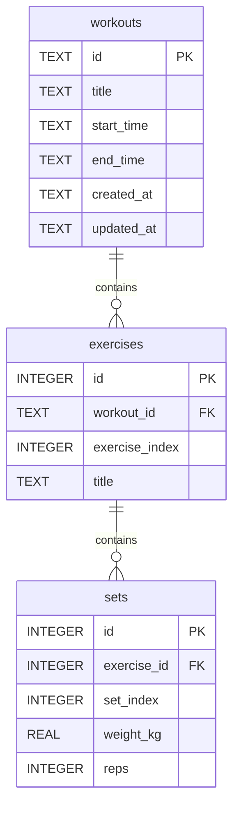

# Hevy Docker Server

Small Express + SQLite service for syncing workout data from the Hevy API into a local relational database.

## What It Does

- Stores workouts in `hevy.db`
- Syncs workout history from Hevy into normalized tables
- Exposes simple local APIs to trigger sync and read stored workouts

The sync flow uses Hevy's workout endpoints:

- `GET /v1/workouts/count`
- `GET /v1/workouts`

Reference: [Hevy workout API docs](https://api.hevyapp.com/docs/#/Workouts/get_v1_workouts)

## Stack

- Node.js 24+
- TypeScript
- Express
- SQLite via `better-sqlite3`
- Docker / Docker Compose

## Environment

The app reads these environment variables:

| Variable                | Required                | Default          | Purpose                                                                                                             |
| ----------------------- | ----------------------- | ---------------- | ------------------------------------------------------------------------------------------------------------------- |
| `PORT`                  | No                      | `3000`           | HTTP port for the Express server                                                                                    |
| `DB_PATH`               | No                      | `./data/hevy.db` | Path to the SQLite database file                                                                                    |
| `HEVY_API_KEY`          | Required for `/sync`    | empty            | Hevy API key sent as the `api-key` request header                                                                   |
| `WEBHOOK_AUTH_TOKEN`    | Required for `/webhook` | empty            | Must match Hevy’s “authorization header” value; sent as `Authorization: <token>` or `Authorization: Bearer <token>` |
| `RATE_LIMIT_MAX_PER_IP` | No                      | `300`            | Max requests per client IP per 15 minutes (all routes)                                                              |

Example `.env`:

```env
HEVY_API_KEY=your_hevy_api_key_here
WEBHOOK_AUTH_TOKEN=hevy-webhook-token
# Optional
RATE_LIMIT_MAX_PER_IP=300
```

## Running

### Local dev

```bash
npm install
npm run dev
```

### Production build

```bash
npm run build
npm start
```

### Docker Compose

```bash
docker compose up --build
```

The compose setup mounts `/data` as a persistent volume and stores the database at `/data/hevy.db`.

## Local API

### `GET /health`

Basic health check.

Response:

```json
{ "ok": true }
```

### `POST /sync`

Pulls workout data from Hevy and stores it in SQLite.

Behavior:

1. Calls `GET /v1/workouts/count`
2. Pages through `GET /v1/workouts?page=N`
3. Upserts each workout
4. Replaces that workout's exercises and sets with the latest data from Hevy

Example:

```bash
curl -X POST http://localhost:3000/sync
```

Example response:

```json
{
  "ok": true,
  "workout_count": 42,
  "page_count": 5,
  "synced_workouts": 42
}
```

Failure response:

```json
{
  "ok": false,
  "error": "HEVY_API_KEY environment variable is required for sync"
}
```

### `GET /workouts/latest`

Returns the **single most recent** workout from the local database, with the same nested shape as one element of `GET /workouts` `items` (exercises and sets included). Ordering matches “latest”: `start_time` descending, then `created_at` descending, then `id` descending.

Example:

```bash
curl http://localhost:3000/workouts/latest
```

Example response shape (one workout object, not wrapped in `items`):

```json
{
  "id": "b459cba5-cd6d-463c-abd6-54f8eafcadcb",
  "title": "Morning Workout",
  "start_time": "2021-09-14T12:00:00Z",
  "end_time": "2021-09-14T13:00:00Z",
  "created_at": "2021-09-14T12:00:00Z",
  "updated_at": "2021-09-14T13:05:00Z",
  "exercises": [
    {
      "id": 1,
      "workout_id": "b459cba5-cd6d-463c-abd6-54f8eafcadcb",
      "exercise_index": 0,
      "title": "Bench Press (Barbell)",
      "sets": [
        {
          "set_index": 0,
          "weight_kg": 100,
          "reps": 10
        }
      ]
    }
  ]
}
```

If the database has no workouts:

```json
{
  "ok": false,
  "error": "No workouts found"
}
```

(Response status **404**.)

### `GET /exercises/:title/history`

Returns up to **N** recent **workout sessions** in which an exercise with the given **title** appeared, **newest first**. The `:title` path segment should be URL-encoded (e.g. spaces as `%20`). Matching is **case-insensitive**.

Query parameters:

| Parameter | Default | Max  | Description                                                           |
| --------- | ------- | ---- | --------------------------------------------------------------------- |
| `limit`   | `5`     | `20` | How many sessions to return (invalid values fall back to the default) |

Date/time for each session is `COALESCE(start_time, created_at)` from the workout row. Timestamps are returned as stored (typically ISO 8601 strings).

Example:

```bash
curl "http://localhost:3000/exercises/Bench%20Press%20%28Barbell%29/history?limit=10"
```

Example response:

```json
{
  "exercise": "Bench Press (Barbell)",
  "sessions": [
    {
      "workout_id": "b459cba5-cd6d-463c-abd6-54f8eafcadcb",
      "workout_title": "Morning Workout",
      "date": "2021-09-14T12:00:00Z",
      "sets": [
        { "set_index": 0, "weight_kg": 100, "reps": 10 },
        { "set_index": 1, "weight_kg": 100, "reps": 8 }
      ]
    }
  ]
}
```

The `exercise` field uses the title as stored in the database when there is at least one session; if the exercise has never been recorded, `sessions` is `[]` and `exercise` is the requested title (**200 OK**).

### `GET /workouts`

Returns **all** workouts from the local SQLite database with nested exercises and sets.

Example:

```bash
curl http://localhost:3000/workouts
```

Example response shape:

```json
{
  "items": [
    {
      "id": "b459cba5-cd6d-463c-abd6-54f8eafcadcb",
      "title": "Morning Workout",
      "start_time": "2021-09-14T12:00:00Z",
      "end_time": "2021-09-14T13:00:00Z",
      "created_at": "2021-09-14T12:00:00Z",
      "updated_at": "2021-09-14T13:05:00Z",
      "exercises": [
        {
          "id": 1,
          "workout_id": "b459cba5-cd6d-463c-abd6-54f8eafcadcb",
          "exercise_index": 0,
          "title": "Bench Press (Barbell)",
          "sets": [
            {
              "set_index": 0,
              "weight_kg": 100,
              "reps": 10
            }
          ]
        }
      ]
    }
  ]
}
```

### `POST /webhook`

Accepts a Hevy webhook payload containing a `workoutId`. After auth and validation it responds **immediately** with `200 OK`, then fetches that workout from Hevy and upserts it into the local `workouts`, `exercises`, and `sets` tables in the background. If the background sync fails, the error is logged server-side (`[webhook] background sync failed …`). Set the same string in Hevy’s webhook “authorization header” field and in `WEBHOOK_AUTH_TOKEN`.

```bash
curl -X POST http://localhost:3000/webhook \
  -H "Authorization: Bearer hevy-webhook-token" \
  -H "Content-Type: application/json" \
  -d '{"workoutId":"f1085cdb-32b2-4003-967d-53a3af8eaecb"}'
```

The server then calls Hevy's single-workout endpoint:

- `GET /v1/workouts/{workoutId}`

Reference: [Hevy single workout API docs](https://api.hevyapp.com/docs/#/Workouts/get_v1_workouts__workoutId_)

Example success response:

```json
{
  "ok": true,
  "accepted": true,
  "workout_id": "f1085cdb-32b2-4003-967d-53a3af8eaecb"
}
```

## Database Structure

The app maintains normalized workout-sync tables.



### Table Notes

#### `workouts`

Stores one row per Hevy workout.

#### `exercises`

Stores one row per exercise inside a workout. This does not store exercise templates, only the actual exercise title used in that workout.

#### `sets`

Stores one row per set with only the fields currently needed:

- `set_index`
- `weight_kg`
- `reps`

## Sync Semantics

- Workouts are upserted by Hevy workout ID, so re-running sync updates existing rows instead of duplicating them.
- Exercises and sets for a workout are deleted and rebuilt during sync so the local DB matches the latest Hevy state for that workout.
- Weight is stored as `weight_kg`.

## Project Layout

```text
src/index.ts          Express app, SQLite schema, Hevy sync logic, API routes
docker-compose.yml    Runtime configuration, env wiring, persistent DB volume
Dockerfile            Multi-stage Docker build
.env.example          Example Hevy API key configuration
```
